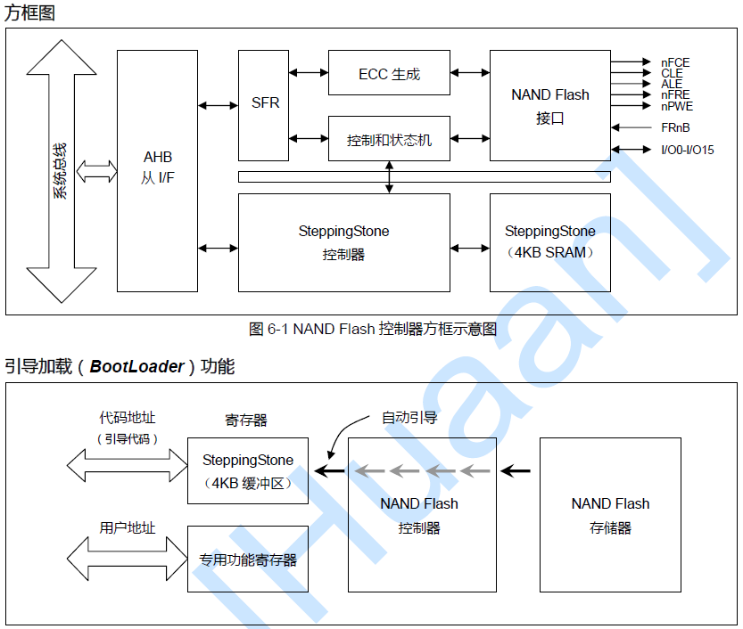
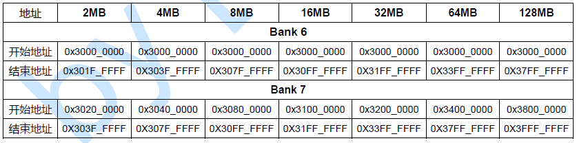

# 1 uboot链接文件

前面第一章已经了解了嵌入式设备的存储介质，以及它们的用途、大致启动流程。但是，对于编译后的代码如何在内存上分配，处理器是不知道，这需要我们人为地指定。这时候，后缀为lds的链接文件出现了，它规定了编译后的代码各个段是如何分配的。理解了它，对于我们对u-boot也是大有帮助的。

## 1.1 uboot.lds文件分析

文件位置：`u-boot/board/mini2440/uboot.lds`

        OUTPUT_FORMAT("elf32-littlearm","elf32-littlearm","elf32-littlearm")/*指定输出可执行文件是elf格式,32位ARM指令,小端*/
        OUTPUT_ARCH(arm)                                                    /*指定输出可执行文件的platform为ARM*/
        ENTRY(_start)                                                       /*指定输出可执行文件的起始地址为_start*/
        SECTIONS
        {
            /* 指定可执行文件（image）的全局入口点，通常这个地址都放在ROM(flash)0x0位置。*/
            /* 必须使编译器知道这个地址，通常都是修改此处来完成 */
            . = 0x00000000;                                 /* 从0x0位置开始 */

            . = ALIGN(4);                                   /* 代码以4字节对齐 */
            .text :
            {
                cpu/arm920t/start.o (.text)                 /* 从start.S文件中的代码开始 */
                cpu/arm920t/s3c24x0/nand_read.o (.text)     /* 关于nand读取的代码 */
                *(.text)                                    /* 其它代码部分*/
            }

            . = ALIGN(4);
            .rodata : { *(SORT_BY_ALIGNMENT(SORT_BY_NAME(.rodata*))) } /*指定只读数据段*/

            . = ALIGN(4);
            .data : { *(.data) }                            /* 指定读/写数据段，RW段 */

            . = ALIGN(4);
            .got : { *(.got) }                              /*指定got段, got段是uboot自定义的一个段, 非标准段*/

            . = .;
            __u_boot_cmd_start = .;                         /*把__u_boot_cmd_start赋值为当前位置, 即起始位置*/
            .u_boot_cmd : { *(.u_boot_cmd) }                /*指定u_boot_cmd段, uboot把所有的uboot命令放在该段.*/
            __u_boot_cmd_end = .;                           /*把__u_boot_cmd_end赋值为当前位置,即结束位置*/

            . = ALIGN(4);
            __bss_start = .;                                /*把__bss_start赋值为当前位置,即bss段的开始位置*/
            .bss (NOLOAD) : { *(.bss) . = ALIGN(4); }       /*指定bss段,告诉加载器不要加载这个段*/
            __bss_end = .;                                  /*把_end赋值为当前位置,即bss段的结束位置*/
        }

同过上面的分析可以看出

1. 由于在链接脚本中规定了文件start.o(对应于start.S)作为整个uboot的起始点，因此启动uboot时会执行首先执行start.S。
2. 一般来说，内存空间可分为代码段、数据段、全局变量段、未初始化变量区、栈区、堆区等.其中，栈区由指针SP决定，堆区实质上是由C代码实现的，其它段则由编译器决定.从上面的分析可以看出，从0x00000000地址开始，编译器首先将代码段放在最开始的位置，然后是数据段，然后是bss段(未初始化变量区).

## 1.2 System.map文件分析

System.map文件内容如下：

        33f80000 T _start
        33f80020 t _undefined_instruction
        ......(中间省略)
        33f80fd8 T start_armboot

如何设置从0x33f80000开始呢?这是链接的时候指定的。在u-boot根目录下面的config.mk中有下面一句：

        LDFLAGS += -Bstatic -T $(LDSCRIPT) -Ttext $(TEXT_BASE) $(PLATFORM_LDFLAGS)

其中的-Ttext $(TEXT_BASE),这句指明了代码段的起始地址。而 TEXT_BASE在 board/mini2440/config.mk 中定义 TEXT_BASE = 0x33F80000

*为什么是0x33F80000呢?*

首先看一下S3C2440的内存分布图：

如上图所示，如果选择NAND flash为引导ROM时，为了支持NAND Flash的BootLoader，S3C2440A配备了一个内置的SRAM 缓冲器，叫做“Steppingstone”， 具体如下图所示。引导启动时，NAND Flash 存储器的开始4K 字节将被自动加载到Steppingstone 中并且执行自动加载到Steppingstone的引导代码。

所以说，虽然我们在链接文件u-boot.lds中指定了起始地址是0x00000000，但是在config.mk的编译构造文件中还指定了起始地址是0x33f80000。因为我们的u-boot代码在上面的4k代码执行完成后，还是要跳转到0x33f80000处执行的。所以，链接文件中的默认0x00000000起始地址不需要起作用。

查看S3C2440的datasheet，如下图所示，

可以看出64M空间对应的地址为0x30000000~0x33FFFFFF。TEXT_BASE=0x33F80000 即为程序加载起始地址，可以使用的空间大小即为 0x33F80000 到 0x33FFFFFF 共 512K ，如果你u-boot包含的功能太多，觉得不够用，你可以把 0x33F80000调小一点， 即和往低地址移一些，移的过程中注意内存页对齐就行了，一般是4KB.

## 1.3 链接文件语法

下面是一些lds文件的语法

### 1.3.1 .got语法

在了解这个语法之前，我们先来了解一些其他概念：

#### 1.加载时重定位

基本思路是：在链接时，对所有绝对地址的引用不作重定位，而把这一步推迟到装载时再完成。一旦模块装载地址确定，即目标地址确定，那么系统就对程序中所有的绝对地址引用进行重定位。

设函数foobar相对于代码段的起始地址是0x100,当模块被装载到0x10000000时，我们假设代码段位于模块的最开始，即代码段的装载地址也是0x10000000,那么我们就可以确定foobar的地址为0x10000100。这时候，系统遍历模块中的重定位表，把所有对foobar的地址引用都重定位至0x10000100。

#### 2.地址无关代码

地址无关代码（position-independent-code，PIC），又称为地址无关可执行文件（position-independent-executable，PIE）。

加载时重定位解决了动态模块中有绝对地址引用的问题，但是又带来了指令部分无法在多个进程间共享的问题。

具体想法就是把程序模块中共享的指令部分在加载时不需要因为加载地址的改变而改变。把指令中那些需要被修改的部分分离出来，跟数据部分放在一起，这样指令部分就可以保持不变，而数据部分可以在每个进程中拥有一个副本。这种方案就是目前的地址无关代码（PIC）技术。

具体方法：先分析模块中各种类型的地址引用方式，把共享对象模块中地址引用按照是否跨模块分为两类：模块内部引用和模块外部引用。按照不同的引用方式又可以分为指令引用和数据访问。

      1. 第一种是模块内部的函数调用、跳转等。
      2. 第二种是模块内部的数据访问，比如模块中定义的全局变量、静态变量。
      3. 第三种是模块外部的函数调用、跳转等。
      4. 第四种是模块外部的数据访问，比如其它模块中定义的全局变量。

#### 3.全局偏移表（GOT）

对于类型三，我们需要用到代码地址无关（PIC）技术，基本的思想就是把跟地址相关部分放到数据段里面。 ELF的做法是在数据段里建立一个指向这些变量的指针数组，称为全局偏移表（GOT），当代码需要引用该全局变量时，可以通过GOT中相对应的项间接引用。由于GOT本身是放在数据段的，所以它可以在模块装载时被修改，并且每个进程都可以有独立的副本，相互不受影响。

对于跨模块的数据访问也是如此，不做细致分析了。
