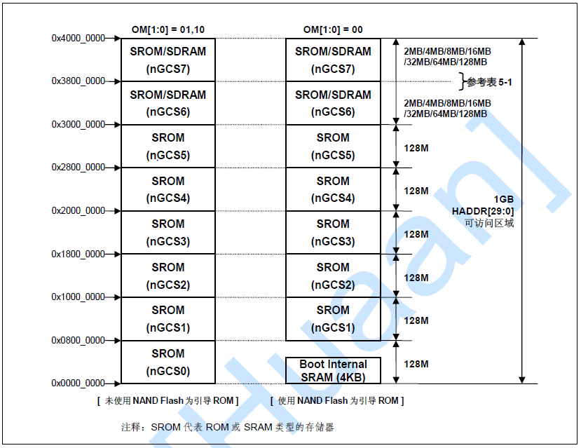

# 1 uboot链接文件

前面第一章已经了解了嵌入式设备的存储介质，以及它们的用途、大致启动流程。但是，对于编译后的代码如何在内存上分配，处理器是不知道，这需要我们人为地指定。这时候，后缀为lds的链接文件出现了，它规定了编译后的代码各个段是如何分配的。理解了它，对于我们对u-boot也是大有帮助的。

## 1.1 uboot.lds文件分析

文件位置：`u-boot/board/mini2440/uboot.lds`

        OUTPUT_FORMAT("elf32-littlearm","elf32-littlearm","elf32-littlearm")/*指定输出可执行文件是elf格式,32位ARM指令,小端*/
        OUTPUT_ARCH(arm)                                                    /*指定输出可执行文件的platform为ARM*/
        ENTRY(_start)                                                       /*指定输出可执行文件的起始地址为_start*/
        SECTIONS
        {
            /* 指定可执行文件（image）的全局入口点，通常这个地址都放在ROM(flash)0x0位置。*/
            /* 必须使编译器知道这个地址，通常都是修改此处来完成 */
            . = 0x00000000;                                 /* 从0x0位置开始 */

            . = ALIGN(4);                                   /* 代码以4字节对齐 */
            .text :
            {
                cpu/arm920t/start.o (.text)                 /* 从start.S文件中的代码开始 */
                cpu/arm920t/s3c24x0/nand_read.o (.text)     /* 关于nand读取的代码 */
                *(.text)                                    /* 其它代码部分*/
            }

            . = ALIGN(4);
            .rodata : { *(SORT_BY_ALIGNMENT(SORT_BY_NAME(.rodata*))) } /*指定只读数据段*/

            . = ALIGN(4);
            .data : { *(.data) }                            /* 指定读/写数据段，RW段 */

            . = ALIGN(4);
            .got : { *(.got) }                              /*指定got段, got段是uboot自定义的一个段, 非标准段*/

            . = .;
            __u_boot_cmd_start = .;                         /*把__u_boot_cmd_start赋值为当前位置, 即起始位置*/
            .u_boot_cmd : { *(.u_boot_cmd) }                /*指定u_boot_cmd段, uboot把所有的uboot命令放在该段.*/
            __u_boot_cmd_end = .;                           /*把__u_boot_cmd_end赋值为当前位置,即结束位置*/

            . = ALIGN(4);
            __bss_start = .;                                /*把__bss_start赋值为当前位置,即bss段的开始位置*/
            .bss (NOLOAD) : { *(.bss) . = ALIGN(4); }       /*指定bss段,告诉加载器不要加载这个段*/
            __bss_end = .;                                  /*把_end赋值为当前位置,即bss段的结束位置*/
        }

同过上面的分析可以看出

1. 由于在链接脚本中规定了文件start.o(对应于start.S)作为整个uboot的起始点，因此启动uboot时会执行首先执行start.S。
2. 一般来说，内存空间可分为代码段、数据段、全局变量段、未初始化变量区、栈区、堆区等.其中，栈区由指针SP决定，堆区实质上是由C代码实现的，其它段则由编译器决定.从上面的分析可以看出，从0x00000000地址开始，编译器首先将代码段放在最开始的位置，然后是数据段，然后是bss段(未初始化变量区).

## 1.2 System.map文件分析

System.map文件内容如下：

        33f80000 T _start
        33f80020 t _undefined_instruction
        ......(中间省略)
        33f80fd8 T start_armboot

如何设置从0x33f80000开始呢?这是链接的时候指定的。在u-boot根目录下面的config.mk中有下面一句：

        LDFLAGS += -Bstatic -T $(LDSCRIPT) -Ttext $(TEXT_BASE) $(PLATFORM_LDFLAGS)

其中的-Ttext $(TEXT_BASE),这句指明了代码段的起始地址。而 TEXT_BASE在 board/mini2440/config.mk 中定义 TEXT_BASE = 0x33F80000

*为什么是0x33F80000呢?*

首先看一下S3C2440的内存分布图：

